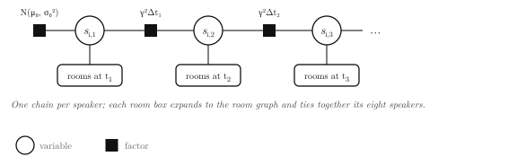
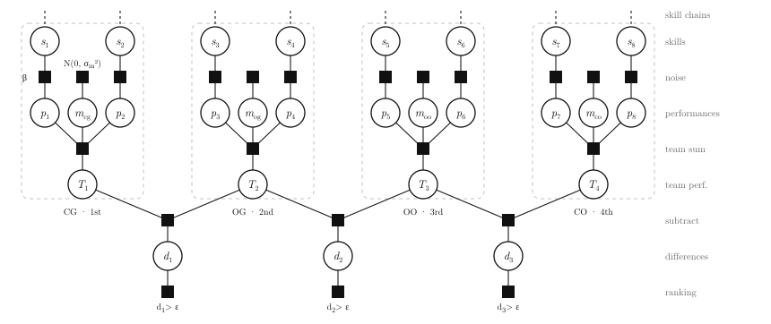
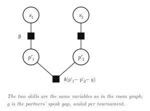

# DebaterSkill

TrueSkill Through Time, rebuilt for British Parliamentary debating. Every
speaker carries a Gaussian skill that drifts over time; every room is a noisy
observation of the skills inside it. Team rankings, speaker-score gaps,
elimination results, motion side offsets, and chair accuracy all enter one
inference pass, and every rating comes out as a posterior with a stated
uncertainty. Python API, C++ core.

## Modelling Debate

Each speaker's skill is a chain through time: a prior, then a drift factor
per gap between appearances, with the rooms of each day hanging off the
chain.



Each room expands into a small factor graph over its eight speakers: skills
produce noisy performances, teams sum their two performances plus the
motion's side offset, and the observed ranking constrains the adjacent
differences of the team performances.



Within a team, the partners' speak gap is a direct observation of the
difference of their performances, splitting the team's credit between them.



## Usage

Install with `pip install .` (needs a C++17 compiler and pybind11).

```python
from debaterskill import Tab, Debate, Outround, Team, Speaker, Motion, Judge

tab = Tab(gamma=0.04, between='ordinal', within='gap')
tab.add(Debate(
    teams=[
        Team(speakers=['ana', 'bo'],  speaks=[76, 75], side='og', points=3),
        Team(speakers=['cy', 'dee'],  speaks=[74, 74], side='oo', points=1),
        Team(speakers=['eli', 'fay'], speaks=[77, 76], side='cg', points=2),
        Team(speakers=['gus', 'hal'], speaks=[73, 75], side='co', points=0),
    ],
    day=5900, motion=Motion('thw-ban-x'), scale=2.0, chair=Judge('rin')))
tab.add(Outround(
    teams=[
        Team(speakers=['ana', 'bo'], side='og', advancing=True),
        Team(speakers=['cy', 'dee'], side='oo', advancing=False),
        Team(speakers=['eli', 'fay'], side='cg', advancing=True),
        Team(speakers=['gus', 'hal'], side='co', advancing=False),
    ],
    day=5901))
tab.fit(iterations=10, epsilon=1e-4)
```

**Rooms.** A `Debate` seats 2 to 4 teams; each team needs `points` (higher is
better). An `Outround` needs `advancing=True/False` instead: each advancing
team beats each eliminated team, with no comparison inside either group.
`speaks` align with `speakers` and may be omitted or partial. `scale` divides
speak values into skill units. `Team(speakers=['x'], iron=True)` is a lone
speaker who gave both speeches and counts twice; `Team(name='Swing A')`
without speakers is rated as one atomic entity.

**Modes.** `between='ordinal'` scores the team ranking as one observation
(`'speaks'` instead fits the raw scores of fully scored rooms).
`within='gap'` splits credit between partners by their score gap
(`'ordinal'` uses only its direction, `None` uses team credit only). `motions=True`
adds a static side offset per motion, prior width `motion_sigma`.
`period='week'` coarsens the time axis; `p_draw` and `p_chaos` are the draw
probability and a robustness mixture, both 0 by default.

**Priors.** Unseen names get `Tab(mu, sigma, beta, gamma)`. Override per
entity with `tab.enroll(Speaker('ana', mu=2.0, sigma=1.0))` or by passing
constructed `Speaker` objects on first appearance.

**Judges (experimental).** Not a standard feature; the blur model is
unvalidated and its estimates are noisy for chairs with few rooms. Do not
use it to rank or evaluate judges. Attach `chair=Judge(name)` to debates,
then:

```python
tab.fit_judges(rounds=2, tau=0.6)   # learn per-chair blur, refit
tab.judges()                        # chair -> (observations judged, blur SD)
```

**Outputs.**

```python
tab.speakers()          # name -> (last day, Gaussian skill)
tab.curves()            # name -> [(day, Gaussian)] skill trajectory
tab.motion_bias()       # (slug, side) -> Gaussian side offset
tab.log_evidence()      # marginal likelihood, also per tag: 'team'/'speaker'/'outround'
tab.forecast(debate)    # held-out log evidence of a new room, no update
```
